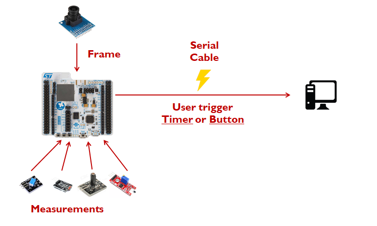

# STM32WB55 MCU project
The goal of this project is to implement a sensor MCU-based network, where the MCU collects data from the nodes (in our case sensors/camera).

## Hardware
  - MCU -> STM32WB55xx based MCU (Nucleo 68 Board)
  - Camera -> OV7670 (I2C and Parallel Data)
  - Temperature sensor -> KY028 (Serial)
  - Vibration/Tilt sensors -> KY020 / KY002 (Serial)
  - Light sensor -> KY018 (Serial)

## Summary
So for the MCU_Base_App a diagram of operation:

  

So, all in all:
 - MCU can collect and store a frame from OV7670 camera module
 - Sample the GPIO pins for the sensors values (Analog/Digital)
 - Perform a routine afterwards based on the data (That is left up to the user)
 
 **/MCU_Base_App folder** has the STM32IDE workspace folder (can be ported directly)
 
#### MCU GPIOs - Sensors/Camera Pins

| MCU GPIOs | Function | Sensors/Camera Pins |
| ------ | ------ | ------ |
| ------ | **MCU** | ------ |
| PB6 | UART Transmit (TX) | ------ |
| PB7 | UART Transmit (RX) | ------ |
| ------ | **CAMERA** | ------ |
| PA0-PA7 | Camera Parallel Output | Data0-Data7 |
| PB4 | Vertical sync | VSYNC |
| PC3 | Horizontal sync | HSYNC |
| PC1 | Pixel clock | PXCLK |
| PC10 | Camera Reset | RET |
| PC12 | Camera Power Down | PWDN |
| PA8 | Camera Input clock | XCLK |
| PB8 | I2C SCL | SIO_C |
| PB9 | I2C SDA | SIO_D |
| ------ | **SENSORS** | ------ |
| PB2 | Digital serial KY-002 | D0 |
| PC0 | Analog serial KY-018 | A0 |
| PE4 | Digital serial KY-020 | D0 |
| PC2 | Analog serial KY-028 | A0 |
| PC5 | Digital serial KY-028 | D0 |

Right above is the table with the GPIO connections used for the project (RFD_App and Base_App). A detailed table is also included at the start of the main.c source file.
Power for the camera is given from the 3.3V arduino supply pin on the board and for the sensors from the IOREF pin (also a 3.3V supply).

## Source code
### MCU_Base_App
In the **/Core/src** sub-folder the main logic is implemented, namely:
- **Drivers/sensor_lib.c** -> The sensor's routines and necessary data structures
- **Drivers/OV7670.c** -> Has the routines to setup, configure, get frames and transfer from the camera module
- **Drivers/uart.c** -> UART expansion driver, routines that imitate printf() function call
- **main.c** -> Assembles the drivers and uses them to print data to the serial terminal (frame or sensor data)

Every .c file (of the above) has its corresponding header file that has sets of global variables, external routines, etc..

- For the **Drivers/sensor_lib.h** , user can toggle ON/OFF with a simple define every sensor
- For the **Drivers/0V7670.h** , user can change the default values chosen for every camera register, as well as change key parameters of the camera itself

All of the logic is implemented in **Core/main.c** file

### ST App/Project examples
[STM32WB firmware] -> The link is the ST's firmware driver for STM32WB55xx based boards.

## Install
Tools that are needed for the installation or were used to create it:

* [Termite] - Serial terminal used to print messages from UART (one of the many choices)
* [STM32IDE] - STM's IDE used for the building of the source code
* [STM32CubeMX] - Create the code base used for the source code

In order to build the project, user must first install STM32CubeIDE, then:
  - Clone the app folder of their choice
  - Double click the .project file in the app folder
  - IDE should build the project and have it in the file explorer of the IDE
  - Go to menu **Project->Build** to compile the code
  - Then go to menu **Run->Run** to upload the binary to the board

[//]: # (These are reference links used in the body of this note and get stripped out when the markdown processor does its job. There is no need to format nicely because it shouldn't be seen. Thanks SO - http://stackoverflow.com/questions/4823468/store-comments-in-markdown-syntax)

   [Termite]: <https://www.compuphase.com/software_termite.htm>
   [STM32IDE]: <https://www.st.com/en/development-tools/stm32cubeide.html>
   [STM32CubeMX]: <https://www.st.com/en/development-tools/stm32cubemx.html>
   [STM32WB firmware]: <https://github.com/STMicroelectronics/STM32CubeWB>
   [link]: <https://github.com/STMicroelectronics/STM32CubeWB/tree/master/Projects/P-NUCLEO-WB55.Nucleo/Applications/Mac_802_15_4>
